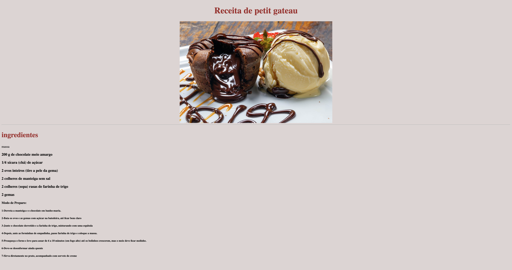

# receita

---
## Sobre
Site para receita. Esse projeto tem como objetivo treinar oque adquirimos de linguagem de marcação, durante o curso de desenvolvimento de sisitema do [SENAI Jandira](https://sp.senai.br/unidade/jandira/)

## tecnologia utilizados
- HTML
- CSS
- Markdon 
- Git

## Autor
- [Fernando Baliana](https://www.linkedin.com/feed/)
